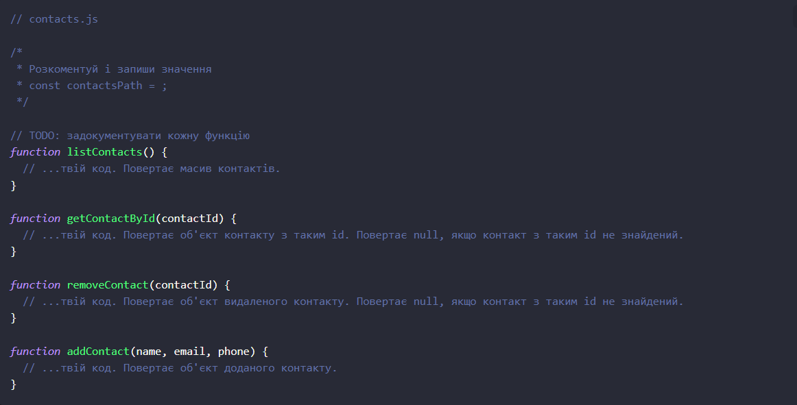
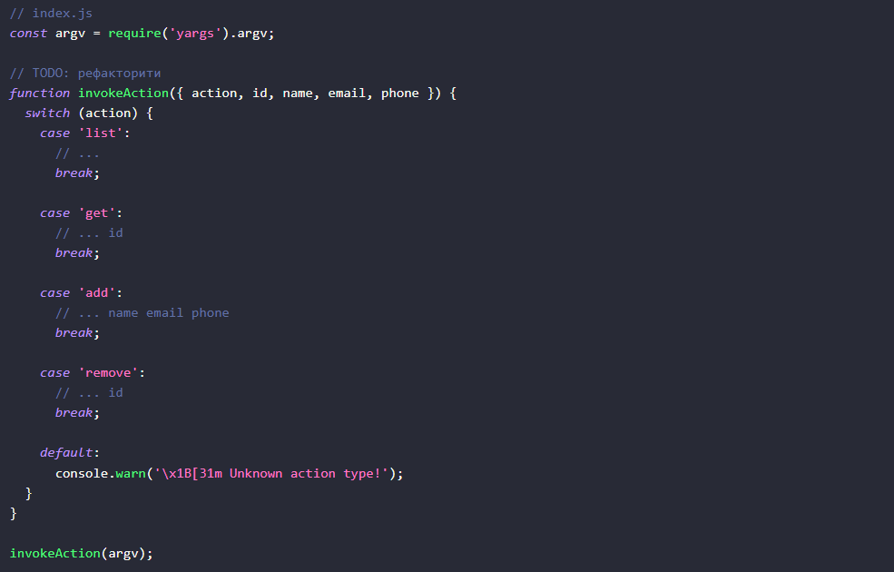
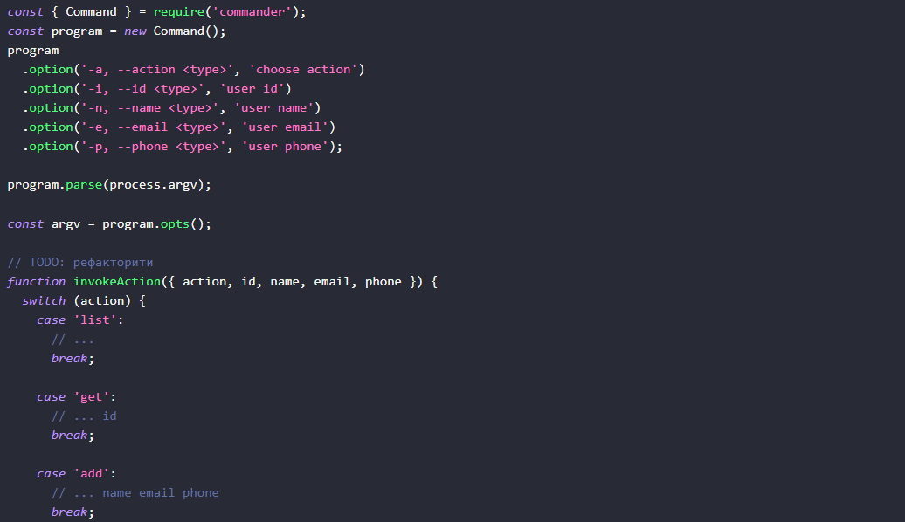
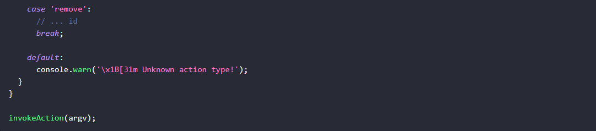
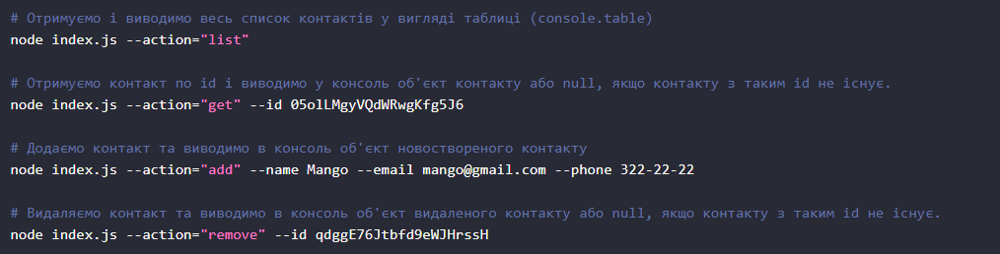

# nodejs-hw-01

### Крок 1
~~~
Ініціалізуй проєкт за допомогою команди npm init
В корені проєкту створи файл index.js
Встанови пакет nodemon як залежність розробки (devDependencies)
В файлі package.json додай "скрипти" для запуску index.js
Скрипт start, який запускає index.js за допомогою node
Скрипт dev, який запускає index.js за допомогою nodemon
~~~

### Крок 2
~~~
У корені проєкту створи папку db. Для зберігання контактів завантаж і використовуй файл contacts.json, поклавши його в папку db.

У корені проєкту створи файл contacts.js.

Зроби імпорт модулів fs (у версії, яка працює з промісами - fs/promises) і path для роботи з файловою системою.
Створи змінну contactsPath і запиши в неї шлях до файлу contacts.json. Для складання шляху використовуй методи модуля path.
Додай функції для роботи з колекцією контактів. У функціях використовуй модуль fs та його методи readFile() і writeFile().
Зроби експорт створених функцій через module.exports.
~~~

### Крок 3
Зроби імпорт модуля contacts.js в файлі index.js та перевір працездатність функцій для роботи з контактами.

### Крок 4
У файлі index.js має імпортуватися пакет yargs для зручного парсу аргументів командного рядка. Використовуй готову функцію invokeAction(), яка отримує тип виконуваної дії і необхідні аргументи. Функція викликає відповідний метод з файлу contacts.js, передаючи йому необхідні аргументи.

Також можеш використати модуль commander для парсингу аргументів командного рядка. Це більш популярна альтернатива модуля yargs

### Крок 5
Запусти команди в терміналі і зроби окремі скріншоти результату виконання кожної команди.

### Крок 6 - Здача домашнього завдання.

Зроби скріншоти виконання команд, які залий на будь-який безкоштовний хмарний сервіс зберігання картинок (приклади: monosnap, imgbb.com ), і відповідні посилання додай в файл README.md (створи цей файл в корені проєкту). Після прикріпи в LMS посилання на репозиторій для перевірки ментором виконаної роботи.

### Критерії прийому

Створено репозиторій з домашнім завданням — CLI додаток
Посилання на репозиторій надіслане ментору на перевірку
Код відповідає технічному завданню проєкту
При виконанні коду не виникає необроблених помилок
Назва змінних, властивостей і методів записана в нотації СamelCase. Використовуються англійські слова, назви функцій та методів містять дієслово
У коді немає закоментованих ділянок коду
Проєкт коректно працює з актуальною LTS-версією Node

